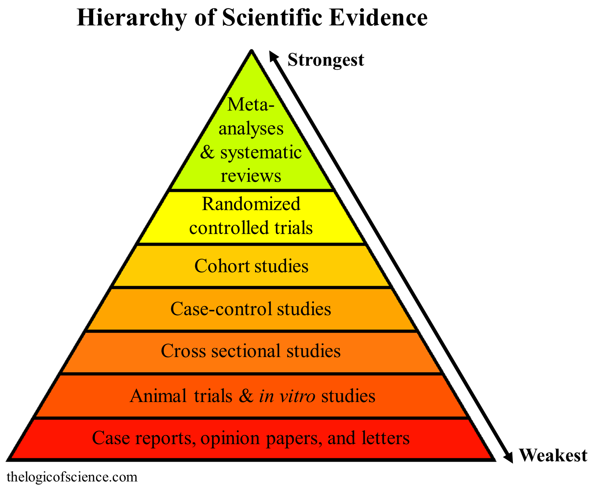
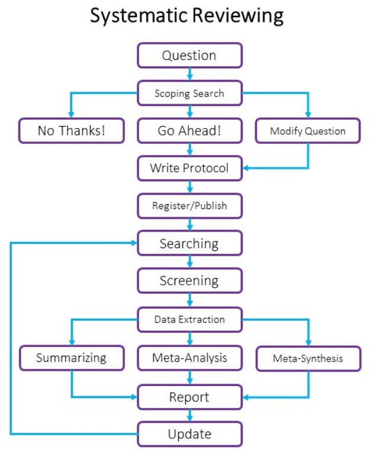
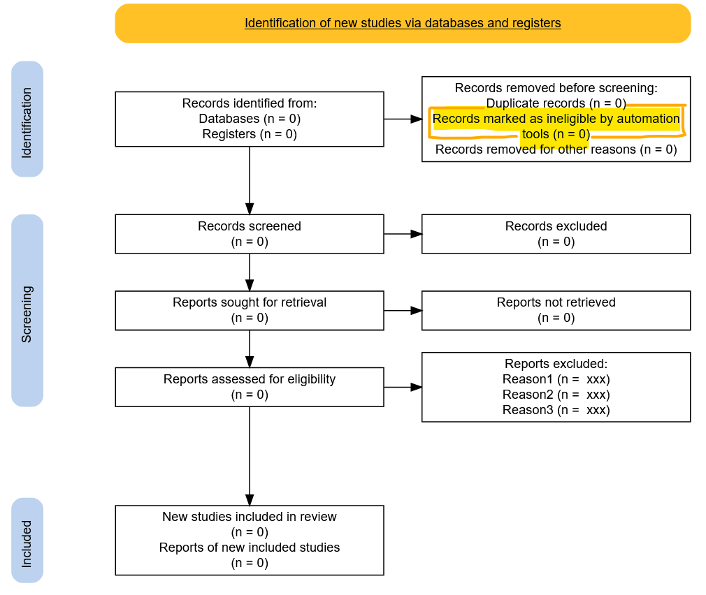
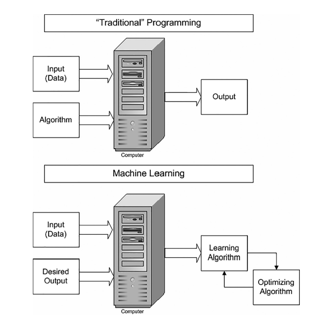
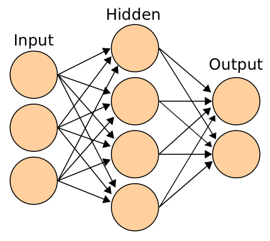
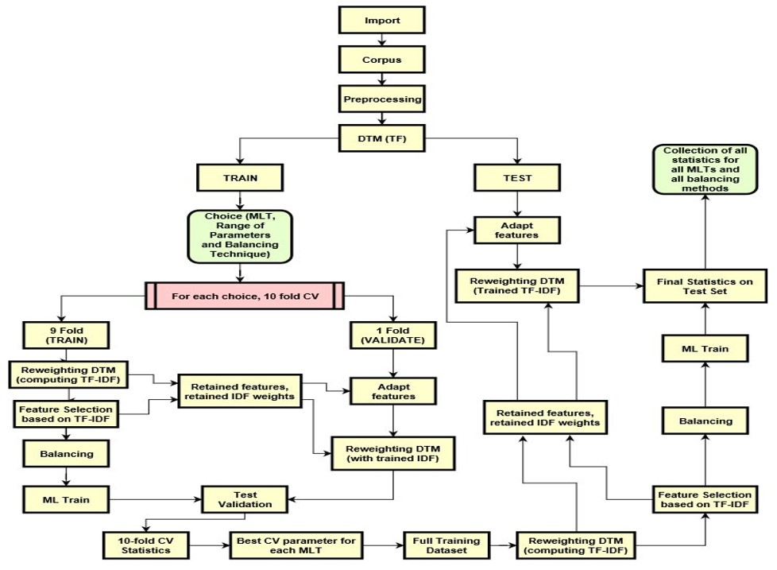

class: center, middle, bg_title, hide-count


```{r setup, include=FALSE}
options(htmltools.dir.version = FALSE)
knitr::opts_chunk$set(
  fig.retina = 3,
  warning = FALSE,
  message = FALSE,
  comment = "",
  out.width = "100%"
)
library(knitr)
library(xaringanExtra)

library(tidyverse)
library(gridExtra)

library(countdown)
library(metathis)

options(width = 59) # fit into the right-column slides

```


```{r xaringans, echo=FALSE}
xaringanExtra::use_tachyons()
xaringanExtra::use_share_again()
xaringanExtra::use_panelset()
xaringanExtra::use_clipboard()
xaringanExtra::use_progress_bar(color = "#0051BA", location = "top")
```

```{r style-share-again, echo=FALSE}
style_share_again(
  share_buttons = c("twitter", "linkedin", "pocket")
)
```


```{r meta, echo=FALSE}
meta() %>%
  meta_general(
    description = "Machine learning assisted Systematic Reviews",
    generator = "xaringan and remark.js"
  ) %>% 
  meta_name("github-repo" = "CorradoLanera/ml4sr") %>% 
  meta_social(
    title = "Machine learning assisted Systematic Reviews",
    url = "https://CorradoLanera.github.io/ml4sr/#1",
    image = "https://github.com/CorradoLanera/ml4sr/raw/main/img/cover.jpg",
    og_type = "website",
    og_author = "UBEP",
    twitter_card_type = "summary",
    twitter_creator = "@CorradoLanera"
  )
```

```{css, echo=FALSE}
.left-code {
  color: #777;
  width: 38%;
  height: 92%;
  float: left;
}
.right-code {
  color: #777;
  width: 55%;
  height: 92%;
  float: right;
  padding-top: 0.5em;
}
.left-plot {
  width: 43%;
  float: left;
}
.right-plot {
  width: 60%;
  float: right;
}
.hide-count .remark-slide-number {
  display: none;
}

.bg_title {
  position: relative;
  z-index: 1;
}

.bg_title::before {    
      content: "";
      background-image: url('img/bg1.png');
      background-size: contain;
      position: absolute;
      top: 0px;
      right: 0px;
      bottom: 0px;
      left: 0px;
      opacity: 0.3;
      z-index: -1;
}

```


```{r xaringan-themer, include=FALSE, warning=FALSE}
library(xaringanthemer)
red <- "#f34213"
purple <- "#3e2f5b"
orange <- "#ff8811"
green <- "#136f63"
white <- "#FFFFFF"
pastel_orange <- "#F97B64"
blu_gray <- "#1F4257"
style_duo_accent(
    colors = c(
        red = red,
        purple = purple,
        orange = orange,
        green = green,
        white = white,
        pastel_orange = pastel_orange,
        blu_gray = blu_gray
    )
)
```


<br>
<br>
<br>
<br>
<br>

# **Machine Learning Assisted**<br>**.orange[Systematic Reviews]**

<br>
<br>
<br>

**Winter School** - Zoom, 2022/01/25 -

Ph.D. in Translational Specialistic Medicine "G. B. Morgagni"

Corrado Lanera | **Unit of Biostatistics, Epidemiology, and Public Health**

---
class: inverse, bottom, right, hide-count


```{r, echo=FALSE, out.width = "50%"}
knitr::include_graphics("img/profilo_CL.jpg")
```
# Find me at...


[`r fontawesome::fa("link")`](https://www.unipd-ubep.it/) [**www.unipd-ubep.it**](https://www.unipd-ubep.it/)

[`r fontawesome::fa("mail-bulk")`](mailto:Corrado.Lanera@ubep.unipd.it) [**Corrado.Lanera .orange[@ubep.unipd.it]**](mailto:Corrado.Lanera@ubep.unipd.it)

[`r fontawesome::fa("github")`](https://github.com/corradolanera)
[`r fontawesome::fa("twitter")`](https://twitter.com/corradolanera)
[`r fontawesome::fa("telegram-plane")`](https://telegram.me/CorradoLanera)
**@CorradoLanera**

[`r fontawesome::fa("github")`](https://github.com/UBESP-DCTV)
**@UBESP-DCTV**


---
class: hide-count


# .orange[Outline]

- What is a **Systematic Review** (SR)

- How **Machine Learning** (ML) works

- How SRs can benefit from **automation** and **ML**

- .orange[Case Study]: **Expanding** PubMed Searches **to** ClinicalTrials.gov

- Issues and challenges


---
class: inverse, middle, center, hide-count

# .orange[What is a **Systematic Review**]
 


---
class: right




---
class: center, middle


```{r, echo=FALSE, out.width = "60%"}

```

[https://systematicreview.info/](https://systematicreview.info/)


---
# Resource-consuming stages

1. **Question**: tens/hundreds of thousands records possibly to be retrieved

  - search string - .orange[how to create?]
  
  - sources - .orange[how to translate?]
  
  - duplicates - .orange[how to identify?]

 <br>

2. **Screening**: tens/hundreds of thousands records possibly to be excluded

  - exclusions - .orange[how much time/resources?]

 <br>

3. **Analyses**: tens/hundreds numbers to extract (possibly from plots)

  - Information retrieval - .orange[how to extract?]

<small>.right[(**...we do not consider (Meta-)Analyses here today...**)]

---
# PRISMA2020 Flow diagram

.left-column[
Preferred Reporting Items for Systematic Reviews and Meta-Analyses

<br>

An evidence-based minimum set of items for reporting in SRs and MAs
]
.right-column[
.center[https://doi.org/10.1371/journal.pmed.1003583]
]

---
class: center, middle
# PRISMA2020 Flow diagram (Shiny assistant)

```{r, echo = FALSE}
knitr::include_app("https://estech.shinyapps.io/prisma_flowdiagram/")
```

Full page: [https://estech.shinyapps.io/prisma_flowdiagram/](https://estech.shinyapps.io/prisma_flowdiagram/)


---
# How to save time?!


## .orange[Automation]...

- Question

  - find-replace / copy-paste search strings
  - regular expressions for translating search strings


- Screening

  - Records mangers for duplicates (MLT-based engine?!)
  - Negative search for records exclusions
  - find-replace text to merge/highlight keywords
  - use distinct colors for distinct keywords

<br>

##.right[....orange[Machine Learning]]


---
class: inverse, middle, center, hide-count

# .orange[How **Machine Learning** works]


---

# What is .orange[Machine Learning]

.bg-washed-green.b--dark-green.ba.bw2.br3.shadow-5.ph4.mt1[
.left[
Machine Learning deals with the study, the design and the development of algorithms that give computers the capability to learn .orange[without being explicitly programmed].
]

.tr[
— Arthur Samuel, 1959
]
]

<br>

.center[]


---
# Machine Learning .orange[input]/.orange[output]


.left-code[
In machine learning, we provide the .orange[input] (data), the desired result, and what comes out is the .orange[learning] algorithm .

<br>
<br>

Mathematically, Machine Learning problems are simply .orange[*optimization*] problems

]

.right-plot[

```{r, echo=FALSE, message=FALSE, warning=FALSE, fig.align='center', out.width="100%"}

```
]


---
# Types of .orange[learning]

#### .orange[Unsupervised] learning

> The input data is _not labeled_ (there are not right answers!)

Data is given to the model, which is left to learn optimal .orange[patterns]/.orange[clusters].


#### (Passive) .orange[Supervised] learning

> The learning algorithm is provided with a set of inputs along with the corresponding .orange[correct] outputs.

The algorithm compares its current inferred output with the correct one to learn from its .orange[errors] (i.e., to minimize it).


#### .orange[Active] learning

> The learning algorithm .orange[interactively] queries a user (the _oracle_) to label new data with the desired (correct) outputs.

With input data labeled on the fly by .orange[oracle's knowledge], the model cycles query/train stages on the left unlabeled data.


---
# Learning's .orange[Neurons]

I.e., anything more than old new-fashioned (generalized*) logistic regressions

<br>

.center[]

<br>

$\text{output(s)} = g(\sum_{i=1}^n a_i*w_i)$

<br>

\*generalized := any **non-linear**, **differentiable**, $g:\mathbb{R}^n\to \mathbb{R}$ activation function.


---
# ML: .orange[optimized] neurons' network 

.pull-left[


Each $W$ is one base dimension $\longrightarrow$<br>
The error is the height $\longrightarrow$

Every combination of possible Ws has its own error, i.e., an height

Finding better Ws by running down the (smooth) hills, we improve the model's performance! (.orange[It learns!])

]


.pull-right[

Select some (initially random) weights $W$, do the math, obtain a results.

Compare it with the true result, and obtain the error, i.e., a number.

(If the non-linearity $g$ satisfy good mathematical requirements...)
<br>
<br>
<br>


]


---
# .orange[Recurrent] networks


Imagine the arrows exiting the hidden layer re-enter into the
very same hidden layer on the side of the next-piece of input. Loop again and again as needed.
<br>
<br>

.center[]

---
# .orange[Sequencies] (input/output)

You can create models managing .orange[arbitrary sized sequences] of input and output.

<br>

.center[]


---
class: inverse, middle, center, hide-count

# **How SRs can benefit from<br>.orange[automation] and .orange[ML]**


---

# Scoping search

### Questions
- Can we avoid explicit redundancy in the search string?
- Can we use preliminary results to iteratively create a search string?

### ML assistence
- Words variation/synonyms (supervised, one-to-one/one-to-many)
- MeSH extraction (supervised, many-to-many, human checked required)
- Clustering / topic modelling (unsupervised)

---

# Searching

### Question
- How can we make our search string suitable for multiple databases?


### ML assistence
- Machine translations (supervised, many-to-many)
  - E.g., PolyGlot - https://sr-accelerator.com/#/polyglot
- Pre-trained classifiers on records from standard databases search applied to other databases (supervised, many-to-one)
  - E.g., COSTUMER - https://doi.org/10.1016/j.jclinepi.2018.06.015


---
# Screening

### Questions

- How can we filter out records that are not RCTs?
- How can we filter out records I am not interested in?

### ML assistence

- Classify relevant/not relevant (many-to-one)
  - Passive Pre-trained
     - E.g., RoboSearch - https://robotsearch.vortext.systems/
  - Active ranking 
     - E.g., ASReview - https://asreview.nl/

<br>

.orange[Trade-off]: minimize number of papers retained (exploration) Vs Maximize performance (exploitation). It is not possible to find a way to guarantee optimal performance without exploring all the records!


---
class: inverse, center, middle, hide-count
# **Case Study:<br><br>.orange[Expanding] PubMed .orange[searches] <br>.orange[to] ClinicalTrials.gov**


---
# SRs on .orange[Clinical Trials]

Clinical trial registries are under-utilized:

- No hierarchical branching structure
- Text search is based on few fields
- Cannot use queries’ combination
.right[Jones et al 2014, https://doi.org/10.1186/2046-4053-3-126]


<br>

.orange[Baudart et al] 2017 (https://doi.org/10.1136/bmj.j448) reanalyzed 14 Systematic reviews and Meta-analyses, searching not only through standard databases but also in clinical trial registries:

- Increase of patients .orange[from 10% to 50%]
- Change in statistics .orange[up to 29%]

> **~[1.5, 2] years of work for two researchers**:
>
>  - from: 2015/03/16 (first search)
>  - to: [2016/08/11 (first submission), 2017/01/17 (last revision)]


---
# Methodology

**Stage**: .orange[Searching] (Warning: not screening!)

**Learning**: .orange[Passive Supervised]

**Task**: Classification (.orange[many-to-one])


<br>
<br>

**Training set**:
- PubMed (294 positives and 7,200 negative records overall)

**Test**:
- ClinicalTrials.gov (233,609 records)

---
#### **Flowchart**



---
# Results

<br>

**left out 1 of 133 human-detected** positive citations .orange[from 233,609 trials] in ClinicalTrials.gov

<br>
<br>

The ability to distinguish on-topic from off-topic articles ranged from an area under the receiver operator characteristic curve .orange[(AUC-ROC) of 93.4% to 99.9%].

<br>
<br>
<br>
<br>
<br>
<br>

<small>.right[
— Lanera et al 2018<br> https://doi.org/10.1016/j.jclinepi.2018.06.015
]

---
class: inverse, hide-count

# .orange[Issues] **and** .orange[challenges]
### ML technologies need

- Transparency

- Validation

- **FAIR** principles

  - **F**indable (publication bias, data repositories)
  - **A**ccessible (standard protocols/APIs, authentication and authorization)
  - **I**nteroperability (cross-communications)
  - **R**eusability (license, attribution, updatable)

- Trust

.bg-washed-green.b--dark-green.ba.bw2.br3.shadow-5.ph4.mt5[
**Issue**: High number of new (and forgotten) tools, and updates
]


---

# .orange[Vienna Principles] (shortened)

.orange[International Collaboration for the Automation of System Reviews] (ICASR) 2015/10/02, Vienna Austria - https://ebrnetwork.org/the-vienna-principles/

- SRs involve multiple tasks: **all must be improved**.

- **Automation may assist with all tasks**.

- The processes for each task **can and should be continuously improved**.

- Automation must **facilitate** the production of SRs w/ **high standards**.

- Developments should also provide for **flexibility in combining and using**.

- To improve reviews as a whole will require **collaboration** between groups.

- Every automation technique **should be shared for free**.

- All automation techniques and tools should be evaluated using a **recommended and replicable method** with results and data reported.


---

# Find SR's .orange[ML assistant]


- http://systematicreviewtools.com , a web-based catalog of tools that support various tasks within the systematic review and wider evidence synthesis process. It was originally developed by .orange[Dr Christopher Marshall and Anthea Sutton], launching in 2014. 

- https://icasr.github.io , .orange[International Collaboration for the Automation of Systematic Reviews], a global network of a few dozen teams interested in the automation of systematic reviews.

- https://sr-accelerator.com/#/tools , .orange[Institute for Evidence Based Healthcare] (IEBH) Systematic Review Accelerator's recommended tools.

- https://library-guides.ucl.ac.uk/systematic-reviews/software , a range of software available for systematic reviews, especially to support screening and data extraction but also for other stages of the process, curated by the .orange[University College of London's library].


---
class: inverse, center, middle, hide-count


.bg-washed-green.b--dark-green.ba.bw2.br3.shadow-5.ph4.mt5[
.left[
_If you think the only acceptable performance is the ".orange[perfect performance]",<br>AI is not for you!<br>But, I've heard that even humans have made mistakes..._
]

.tr[
— Daniel Oberski<br>2021/03/26 ASReview interview<br>https://daob.nl/
]
]

<br>

# Thank .orange[you] for the attention!


<br>
<br>

Slides: https://corradolanera.github.io/ml4sr/


[`r fontawesome::fa("link")`](https://www.unipd-ubep.it/) [**www.unipd-ubep.it**](https://www.unipd-ubep.it/) | 
[`r fontawesome::fa("mail-bulk")`](mailto:Corrado.Lanera@ubep.unipd.it) [**Corrado.Lanera@ubep.unipd.it**](mailto:Corrado.Lanera@ubep.unipd.it)

[`r fontawesome::fa("github")`](https://github.com/corradolanera)
[`r fontawesome::fa("twitter")`](https://twitter.com/corradolanera)
[`r fontawesome::fa("telegram-plane")`](https://telegram.me/CorradoLanera)
**@CorradoLanera** | 
[`r fontawesome::fa("github")`](https://github.com/UBESP-DCTV)
**@UBESP-DCTV**


